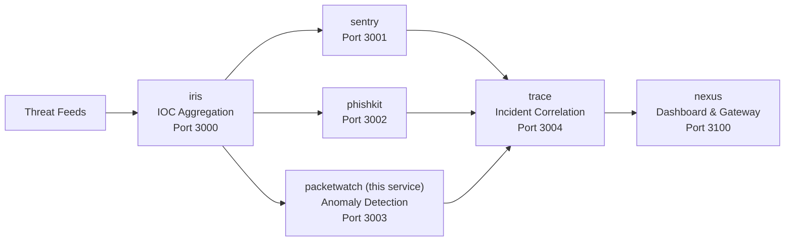

# PacketWatch — Network Anomaly Detection

Behavioral baselines and z-score anomaly detection for network metrics. Designed for edge-collected data from sensors, Cloudflare analytics, VPN gateways, and DNS servers.

## Quick Start

```bash
git clone https://github.com/makhembu/packetwatch
cd packetwatch
cp .env.example .env
npm install
npm run build
npm start
# Server running at http://localhost:3003
```

## Architecture



packetwatch ingests network metrics, computes behavioral baselines, and detects anomalies that feed into trace for incident correlation.

## Docker

```bash
# Build and run standalone
docker build -t packetwatch .
docker run -p 3003:3003 packetwatch

# Run the full ecosystem
docker compose -f ../nexus/docker-compose.yml up
```

## API

### Ingest metrics

Single metric:
```bash
curl -X POST http://localhost:3003/metrics \
  -H "Content-Type: application/json" \
  -d '{"source": "edge_sensor", "metricType": "bytes_in", "value": 1048576, "unit": "bytes"}'
```

Batch:
```bash
curl -X POST http://localhost:3003/metrics/batch \
  -H "Content-Type: application/json" \
  -d '{"metrics": [{"source": "edge_sensor", "metricType": "bytes_in", "value": 1048576}, {"source": "dns_server", "metricType": "dns_queries", "value": 1500}]}'
```

### Compute baselines

```bash
curl -X POST http://localhost:3003/baselines/compute
```

### Run anomaly detection

```bash
# Full detection across all sources/metrics
curl -X POST http://localhost:3003/detect/run

# Single metric pair
curl -X POST http://localhost:3003/detect/edge_sensor/bytes_in
```

### Query anomalies

```
GET /anomalies?severity=critical&acknowledged=false&source=edge_sensor
POST /anomalies/:id/acknowledge
GET /dashboard
```

## Detection Engine

Computes rolling baselines (mean, stddev) per source/metric pair over a configurable window. Anomalies fire when z-score exceeds threshold (default 2.5):

| z-score | Severity |
|---------|----------|
| ≥ 4.0   | critical |
| ≥ 3.0   | high     |
| ≥ 2.5   | medium   |
| < 2.5   | low      |

## Why

Network anomalies precede incidents. Traffic spikes, DNS query surges, or TLS handshake drops are early indicators of compromise or misconfiguration. PacketWatch detects them statistically without hardcoded thresholds.

## Stack

- TypeScript
- Hono
- better-sqlite3
- Cloudflare Workers + D1 ready

## Roadmap

- [x] Metric ingestion (single + batch)
- [x] Statistical baseline computation (mean, stddev)
- [x] Z-score anomaly detection
- [x] Severity classification
- [ ] Seasonal baseline decomposition
- [ ] Edge agent SDK (Python/Go)
- [ ] Cloudflare Analytics integration
- [ ] Alert forwarding to sentry/trace

## Ecosystem

Part of the threat intelligence ecosystem. PacketWatch anomalies feed into trace for incident correlation alongside iris IOCs, sentry findings, and phishkit reports:

| Service | Port | Description |
|---------|------|-------------|
| [iris](https://github.com/makhembu/iris) | 3000 | IOC aggregation |
| [sentry](https://github.com/makhembu/sentry) | 3001 | Detection rules |
| [phishkit](https://github.com/makhembu/phishkit) | 3002 | Phishing analysis |
| **packetwatch** | **3003** | **Anomaly detection** |
| [trace](https://github.com/makhembu/trace) | 3004 | Incident correlation |
| [nexus](https://github.com/makhembu/nexus) | 3100 | Dashboard & gateway |

Use `threat-stack.ps1` from the repo root to run all services: `.\threat-stack.ps1 start`
